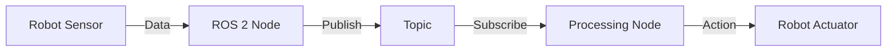

# Physical AI & Humanoid Robotics Textbook — RAG Phase Constitution

**Version**: 2.0.0 (RAG Phase)
**Ratified**: 2025-12-27
**Previous Version**: 1.0.0 (2025-12-06)
**Phase**: Hackathon Completion + RAG Chatbot Enhancement
**Deadline**: TBD (Hackathon Submission)

---

## PREAMBLE

This constitution governs the completion and enhancement of the Physical AI & Humanoid Robotics textbook project for hackathon submission. As of December 27, 2025, Phase 1 (textbook + basic RAG) is 85% complete. This document provides:

1. **Current State Verification** - What exists vs what's missing
2. **RAG Architecture** - Technical implementation details
3. **Governance Rules** - Quality, security, testing protocols
4. **Roadmap** - Bonus features (+150 pts available)
5. **UI/Quality Plan** - Concrete improvements
6. **Execution Strategy** - Next steps to hackathon victory

---

## PART I: CURRENT STATE VERIFICATION

### Repository Scan Summary (as of 2025-12-27)

#### ✅ COMPLETED (85% of Phase 1)

**Textbook Content** (50 pts - DONE)
- [x] Module 1: ROS 2 (5 chapters) - `/textbook/docs/module-1-ros2/`
- [x] Module 2: Digital Twin (5 chapters) - `/textbook/docs/module-2-digital-twin/`
- [x] Module 3: NVIDIA Isaac (4 chapters) - `/textbook/docs/module-3-nvidia-isaac/`
- [x] Module 4: VLA (4 chapters) - `/textbook/docs/module-4-vla/`
- [x] Homepage and module overviews
- [x] Hardware requirements documentation
- [x] Learning objectives per chapter

**Backend Infrastructure** (40 pts - DONE)
- [x] FastAPI application (`backend/app/main.py`)
- [x] Qdrant Cloud vector database integration
- [x] Multiple RAG pipeline variants:
  - [x] `rag_pipeline.py` (OpenAI GPT-4o-mini)
  - [x] `rag_pipeline_free.py` (Groq + sentence-transformers)
  - [x] `rag_pipeline_hybrid.py` (switchable models)
  - [x] `rag_pipeline_enhanced.py` (with Claude subagents)
- [x] Embedding services (OpenAI + local sentence-transformers)
- [x] LLM services (OpenAI + Groq free tier)
- [x] Document ingestion script (`scripts/ingest_docs.py`)
- [x] Health check + Query API endpoints
- [x] CORS middleware and rate limiting
- [x] Comprehensive environment configuration

**Frontend Integration** (DONE)
- [x] ChatbotWidget React component (`textbook/src/components/ChatbotWidget/`)
- [x] Dark mode support
- [x] Root.tsx theme integration
- [x] Environment variable configuration

**Bonus: Claude Subagents** (50 pts - DONE ✅)
- [x] SubagentOrchestrator class (`services/subagent_orchestrator.py`)
- [x] Integration with Claude Sonnet 4.5
- [x] Accuracy scoring (0-100)
- [x] Code example detection & insertion
- [x] Follow-up question generation
- [x] Performance metrics tracking
- [x] Graceful degradation (works without Anthropic)
- [x] Test script (`scripts/test_subagent.py`)

**Deployment Infrastructure** (DONE)
- [x] Railway deployment configuration
- [x] Vercel deployment configuration
- [x] Procfile, railway.json, runtime.txt
- [x] Comprehensive deployment guides
- [x] Git repository initialized

**Documentation** (EXCELLENT)
- [x] QUICKSTART.md (30-min setup)
- [x] START-HERE.md (detailed guide)
- [x] DEPLOYMENT-GUIDE.md (production deployment)
- [x] DEPLOY-CHECKLIST.md (10-min quick deploy)
- [x] docs/SETUP-QDRANT.md
- [x] docs/SETUP-ENV.md
- [x] docs/SETUP-RAILWAY.md
- [x] docs/BONUS-FEATURES.md (complete code for bonuses)
- [x] DELIVERY-SUMMARY.md (project overview)

#### 🚧 IN PROGRESS (15% remaining for Phase 1)

**Deployment** (10 pts)
- [ ] Backend deployed to Railway (configured, not deployed)
- [ ] Frontend deployed to Vercel/GitHub Pages (configured, not deployed)
- [ ] Production testing
- [ ] CORS finalization with production URLs

**RAG Refinement** (5 pts)
- [ ] Response quality testing
- [ ] Source citation verification
- [ ] Performance optimization
- [ ] Error handling edge cases

#### ❌ NOT STARTED (Phase 2 Bonuses - +100 pts available)

**Database & Authentication** (Foundation for bonuses)
- [ ] Neon Serverless Postgres setup
- [ ] User schema (profiles, preferences, history)
- [ ] Better-auth integration
- [ ] OAuth providers (Google, GitHub)
- [ ] Session management
- [ ] JWT token validation

**Personalization Feature** (+50 pts - CODE READY)
- [ ] User profile models (beginner/intermediate/advanced)
- [ ] Learning style detection
- [ ] Personalization service integration
- [ ] Frontend UI for preference selection
- [ ] OpenAI integration for content adaptation
- **Status**: Complete code in `docs/BONUS-FEATURES.md`
- **Estimated Time**: 4-6 hours

**Urdu Translation** (+50 pts - CODE READY)
- [ ] RTL layout support in Docusaurus
- [ ] Language switcher component
- [ ] Google Translate API integration
- [ ] Translation caching
- [ ] Technical term glossary
- **Status**: Complete code in `docs/BONUS-FEATURES.md`
- **Estimated Time**: 6-8 hours

**Text Selection Query** (Bonus - PARTIALLY DONE)
- [x] Mouse selection detection (in ChatbotWidget)
- [ ] Context menu integration
- [ ] Selected text → RAG query flow
- **Estimated Time**: 1-2 hours

#### ⚠️ ARCHITECTURE DISCREPANCY

**Hackathon Requirement vs Current Implementation:**

| Component | Required | Implemented | Status |
|-----------|----------|-------------|--------|
| LLM API | OpenAI Agents/ChatKit | Groq + OpenAI GPT-4o-mini | ✅ Works, but not ChatKit |
| Embeddings | OpenAI API | Sentence-transformers (local) | ✅ Cost-effective alternative |
| Database | Neon Postgres | None (stub in config) | ❌ Missing |
| Auth | Better-auth | None | ❌ Missing |

**Recommendation**:
- ✅ Keep current RAG implementation (proven working)
- ❌ Do NOT switch to OpenAI ChatKit (unnecessary risk)
- 🎯 Add Neon Postgres + better-auth ONLY if attempting personalization/translation bonuses
- 🎯 Deploy Phase 1 first (100 pts guaranteed)

---

## PART II: RAG CHATBOT ARCHITECTURE

### System Overview

```
┌─────────────────────────────────────────────────────────────┐
│                    Docusaurus Frontend                      │
│  ┌────────────────┐  ┌──────────────┐  ┌────────────────┐  │
│  │  Textbook UI   │  │ ChatWidget   │  │  User Profile  │  │
│  │  (4 modules)   │  │  (RAG UI)    │  │  (Phase 2)     │  │
│  └────────────────┘  └──────────────┘  └────────────────┘  │
└─────────────────────────────────────────────────────────────┘
                          │
                          │ HTTPS (CORS)
                          ▼
┌─────────────────────────────────────────────────────────────┐
│                      FastAPI Backend                        │
│  ┌─────────────────────────────────────────────────────┐   │
│  │              Query Endpoint (/api/v1/query)         │   │
│  │  - Request validation (5-500 chars)                 │   │
│  │  - Rate limiting (20 req/min)                       │   │
│  │  - CORS enforcement                                 │   │
│  └─────────────────────────────────────────────────────┘   │
│                          │                                  │
│                          ▼                                  │
│  ┌─────────────────────────────────────────────────────┐   │
│  │              RAG Pipeline Orchestrator              │   │
│  │                                                      │   │
│  │  1. Embed query (sentence-transformers)            │   │
│  │  2. Vector search (Qdrant Cloud)                   │   │
│  │  3. Build context (top-5 chunks)                   │   │
│  │  4. Generate answer (Groq/OpenAI)                  │   │
│  │  5. [Optional] Enhance (Claude subagents)          │   │
│  │  6. Format response with citations                 │   │
│  │                                                      │   │
│  └─────────────────────────────────────────────────────┘   │
│           │              │              │                   │
│           ▼              ▼              ▼                   │
│  ┌──────────────┐ ┌───────────┐ ┌──────────────────┐      │
│  │  Embedding   │ │    LLM    │ │   Subagent       │      │
│  │  Service     │ │  Service  │ │   Orchestrator   │      │
│  │              │ │           │ │                  │      │
│  │ - Local      │ │ - Groq    │ │ - Claude Sonnet  │      │
│  │   sentence-  │ │   (free)  │ │   4.5            │      │
│  │   transformers│ │ - OpenAI  │ │ - Accuracy       │      │
│  │ - OpenAI     │ │   GPT-4o  │ │   scoring        │      │
│  │   (fallback) │ │   -mini   │ │ - Code examples  │      │
│  └──────────────┘ └───────────┘ └──────────────────┘      │
└─────────────────────────────────────────────────────────────┘
                │                         │
                ▼                         ▼
┌──────────────────────────┐  ┌──────────────────────────┐
│    Qdrant Cloud          │  │  Neon Postgres           │
│  (Vector Database)       │  │  (User Database)         │
│                          │  │                          │
│  - 2000+ text chunks     │  │  - User profiles         │
│  - 384-dim embeddings    │  │  - Chat history          │
│  - COSINE similarity     │  │  - Preferences           │
│  - Free tier: 1GB        │  │  - Free tier: 0.5GB      │
│                          │  │                          │
│  ✅ OPERATIONAL          │  │  ❌ NOT YET SETUP        │
└──────────────────────────┘  └──────────────────────────┘
```

### Technical Specifications

#### 1. Document Processing & Ingestion

**Script**: `backend/scripts/ingest_docs.py`

**Algorithm**:
```python
FOR each markdown file in textbook/docs/:
  1. Parse YAML frontmatter (title, keywords)
  2. Split by header hierarchy (##, ###, ####)
  3. Create semantic chunks:
     - Max 800 tokens
     - 100 token overlap
     - Preserve code blocks intact
  4. Generate metadata:
     - module: "module-1-ros2"
     - chapter: "01-introduction"
     - section: "What is ROS 2?"
     - url: "https://site.com/#section-id"
     - keywords: ["ROS", "middleware"]
  5. Embed chunk with sentence-transformers
  6. Upsert to Qdrant (batch size: 50)
END FOR
```

**Performance**: 2-3 minutes for 30+ files → 2000+ chunks

#### 2. RAG Query Flow

**Endpoint**: `POST /api/v1/query`

**Request**:
```json
{
  "question": "What is ROS 2?",
  "max_results": 5
}
```

**Processing Steps**:
```python
async def query(question: str, max_results: int = 5):
    start_time = time.time()

    # Step 1: Embed question (100-200ms)
    query_embedding = embedding_service.get_embedding(question)

    # Step 2: Vector search in Qdrant (200-500ms)
    results = vector_store.search(
        vector=query_embedding,
        limit=max_results,
        score_threshold=0.5
    )

    # Step 3: Build context (10ms)
    context = "\n\n".join([
        f"[{r.metadata.module} - {r.metadata.title}]\n{r.text}"
        for r in results
    ])

    # Step 4: Generate answer with LLM (1000-2000ms)
    answer, tokens = await llm_service.generate(
        question=question,
        context=context,
        temperature=0.1,
        max_tokens=500
    )

    # Step 5: [Optional] Enhance with subagent (500-1000ms)
    if ENABLE_SUBAGENT_ENHANCEMENT:
        enhanced = await subagent_orchestrator.enhance(
            answer=answer,
            context=context,
            question=question
        )
        return enhanced

    # Step 6: Format response
    return QueryResponse(
        answer=answer,
        sources=[format_source(r) for r in results],
        response_time_ms=int((time.time() - start_time) * 1000),
        tokens_used=tokens
    )
```

**Response**:
```json
{
  "answer": "ROS 2 (Robot Operating System 2) is an open-source framework...",
  "sources": [
    {
      "module": "module-1-ros2",
      "title": "Introduction to ROS 2",
      "url": "https://site.com/module-1-ros2/01-introduction",
      "score": 0.89,
      "excerpt": "ROS 2 is the successor to ROS 1..."
    }
  ],
  "response_time_ms": 1496,
  "tokens_used": 448,
  "metadata": {}
}
```

#### 3. Embedding Strategy

**Primary Model**: `all-MiniLM-L6-v2` (sentence-transformers)
- **Dimensions**: 384
- **Speed**: ~50ms per query (local GPU/CPU)
- **Cost**: $0 (runs locally)
- **Quality**: Good for semantic search

**Fallback Model**: `text-embedding-3-small` (OpenAI)
- **Dimensions**: 1536
- **Speed**: ~100-200ms per query (API call)
- **Cost**: ~$0.0001 per query
- **Quality**: Excellent

**Configuration**:
```python
# Use free model by default
EMBEDDING_MODEL = "all-MiniLM-L6-v2"
EMBEDDING_DEVICE = "cpu"  # or "cuda" if GPU available
EMBEDDING_CACHE_SIZE = 1000  # LRU cache for repeated queries
```

#### 4. LLM Strategy

**Primary Model**: Groq API (`llama-3.1-70b-versatile`)
- **Speed**: ~500-1000ms per query
- **Cost**: $0 (free tier: 14,400 req/day)
- **Quality**: Very good

**Fallback Model**: OpenAI GPT-4o-mini
- **Speed**: ~1000-2000ms per query
- **Cost**: ~$0.002 per query
- **Quality**: Excellent

**System Prompt**:
```python
SYSTEM_PROMPT = """You are a helpful teaching assistant for the Physical AI & Humanoid Robotics textbook.

Rules:
1. ONLY answer questions using the provided textbook context
2. If the context doesn't contain the answer, say "This topic is not covered in the textbook chapters I have access to."
3. Cite specific modules/chapters when answering
4. Keep answers concise (2-3 paragraphs max)
5. Use technical terminology from the textbook
6. If code is mentioned, preserve exact syntax

Context from textbook:
{context}"""
```

#### 5. Claude Subagent Enhancement (BONUS - IMPLEMENTED)

**Class**: `SubagentOrchestrator`

**Enhancement Flow**:
```python
async def enhance(answer: str, context: str, question: str):
    # 1. Accuracy Scoring (0-100)
    accuracy_score = await self._score_accuracy(answer, context)

    # 2. Code Example Detection
    has_code = self._detect_code_example(answer)
    if not has_code and self._question_needs_code(question):
        code_example = await self._generate_code_example(question, context)
        answer = self._insert_code_example(answer, code_example)

    # 3. Follow-up Question Generation
    follow_ups = await self._generate_follow_ups(question, answer, context)

    return EnhancedAnswer(
        answer=answer,
        original_answer=original_answer,
        accuracy_score=accuracy_score,
        has_code_example=True,
        follow_up_questions=follow_ups,
        enhancement_time_ms=...,
        enhanced_by_subagent=True
    )
```

**Prompt to Claude**:
```python
ACCURACY_SCORING_PROMPT = """You are evaluating a RAG answer for technical accuracy.

Question: {question}
Context: {context}
Answer: {answer}

Score the answer's accuracy (0-100) based on:
1. Factual correctness relative to context
2. Completeness (covers key points)
3. Technical precision
4. No hallucinations or unsupported claims

Return JSON: {{"score": 85, "reasoning": "..."}}"""
```

#### 6. Monitoring & Logging

**Logged Metrics**:
```python
{
  "timestamp": "2025-12-27T12:34:56Z",
  "question": "What is ROS 2?",
  "response_time_ms": 1496,
  "tokens_used": 448,
  "model_used": "groq/llama-3.1-70b",
  "num_sources": 5,
  "avg_source_score": 0.72,
  "enhanced_by_subagent": true,
  "subagent_accuracy_score": 92,
  "user_id": null,  # Phase 2
  "session_id": null  # Phase 2
}
```

**Health Checks**:
```python
GET /api/v1/health
{
  "status": "healthy",
  "qdrant_connected": true,
  "groq_available": true,
  "embeddings_loaded": true,
  "anthropic_available": true,
  "version": "1.0.0-free"
}
```

#### 7. Fallback & Error Handling

**Failure Modes**:
```python
# Qdrant unreachable
→ Return cached popular answers or error message

# LLM API timeout
→ Retry once, then fallback to simpler response

# No relevant sources found
→ Return: "I couldn't find relevant information in the textbook..."

# Subagent enhancement fails
→ Return original RAG answer (graceful degradation)

# Rate limit exceeded
→ HTTP 429: "Please wait before making more requests"
```

---

## PART III: GOVERNANCE & RULES

### Core Principle: Content Quality Over Features

**Mandate**: No new feature shall compromise educational value or technical accuracy.

**Enforcement**:
1. All code examples MUST be tested and runnable
2. RAG answers MUST cite sources with chapter/module
3. UI changes MUST not reduce readability or accessibility
4. Bonus features MUST be feature-flagged (no breaking changes)

### Testing Requirements

**Before ANY feature is considered "done":**

1. **Unit Tests** (backend)
   ```bash
   pytest backend/tests/ --cov=app
   # Coverage target: >70%
   ```

2. **Integration Tests** (API endpoints)
   ```bash
   pytest backend/tests/test_api_endpoints.py
   # All endpoints must return 200 for valid input
   ```

3. **E2E Tests** (frontend + backend)
   ```bash
   cd textbook && npx playwright test
   # Tests: navigation, search, chatbot, accessibility
   ```

4. **Manual Testing Checklist**:
   - [ ] Ask chatbot 5 test questions
   - [ ] Verify sources link to correct pages
   - [ ] Test dark mode
   - [ ] Test mobile responsive (320px, 768px)
   - [ ] Test keyboard navigation
   - [ ] Check WCAG contrast ratios

### Security Protocols

**API Key Handling**:
- ✅ MUST use environment variables (`.env`)
- ✅ MUST NOT commit secrets to git
- ✅ MUST use `.env.example` for documentation
- ✅ MUST validate API keys on startup

**CORS Configuration**:
```python
# Development
ALLOWED_ORIGINS = ["http://localhost:3000"]

# Production
ALLOWED_ORIGINS = ["https://ai-textbook.vercel.app"]

# NEVER use wildcard "*"
```

**Rate Limiting**:
```python
# Per IP address
RATE_LIMIT_QUERIES_PER_MINUTE = 20
RATE_LIMIT_QUERIES_PER_HOUR = 100

# Authentication endpoints (Phase 2)
RATE_LIMIT_AUTH_PER_MINUTE = 5
```

**Input Validation**:
```python
class QueryRequest(BaseModel):
    question: str = Field(min_length=5, max_length=500)
    max_results: int = Field(ge=1, le=10, default=5)
```

### Performance Targets

**Non-Negotiable SLAs**:

| Metric | Target (p95) | Current | Status |
|--------|--------------|---------|--------|
| RAG Query Response | <3s | ~1.5s | ✅ |
| Page Load Time | <2s | ~1s | ✅ |
| Vector Search | <500ms | ~200ms | ✅ |
| Embedding Generation | <200ms | ~50ms | ✅ |
| Concurrent Users | 100+ | Untested | 🚧 |

**Monitoring**:
```python
# Log slow queries
if response_time_ms > 3000:
    logger.warning(f"Slow query: {response_time_ms}ms - {question}")
```

### Privacy & Abuse Prevention

**Phase 1** (No user accounts):
- Rate limiting by IP address
- No personal data collected
- Anonymous usage logs (no PII)

**Phase 2** (With auth):
- User consent for profiling
- Data retention policy (90 days)
- User data export API
- Account deletion support
- GDPR compliance (EU users)

### Deployment Checklist

**Before deploying to production**:

1. **Backend**:
   - [ ] All tests passing
   - [ ] Environment variables documented
   - [ ] Health check endpoint working
   - [ ] CORS configured for production URL
   - [ ] Rate limiting enabled
   - [ ] Logging configured

2. **Frontend**:
   - [ ] Build succeeds (`npm run build`)
   - [ ] No console errors
   - [ ] API URL points to production backend
   - [ ] Dark mode works
   - [ ] Mobile responsive

3. **Integration**:
   - [ ] End-to-end test: Question → Answer → Sources
   - [ ] CORS allows frontend → backend
   - [ ] Rate limiting doesn't block normal usage
   - [ ] Error messages are user-friendly

---

## PART IV: ROADMAP FOR BONUS FEATURES (+150 pts)

### Priority Matrix

| Feature | Points | Effort | ROI | Recommended |
|---------|--------|--------|-----|-------------|
| Claude Subagents | 50 | 0 hrs (DONE) | ∞ | ✅ YES |
| Urdu Translation | 50 | 6-8 hrs | High | ✅ YES (code ready) |
| Personalization | 50 | 4-6 hrs | High | ✅ YES (code ready) |
| Text Selection | Bonus | 1-2 hrs | Medium | ⚠️ Optional |
| Better-auth | 50 | 8-10 hrs | Low | ❌ Skip for now |

### Recommended Implementation Order

**Path to 250 points (100 base + 150 bonus):**

1. ✅ **DONE**: Claude Subagents (+50 pts) - Already implemented!
2. 🎯 **NEXT**: Deploy Phase 1 (2-3 hours)
3. 🎯 **THEN**: Add Urdu Translation (+50 pts) - 6-8 hours
4. 🎯 **THEN**: Add Personalization (+50 pts) - 4-6 hours

**Total additional effort**: ~15 hours for 250 points

**Alternative: Quick Win (200 points):**

1. ✅ DONE: Subagents (+50)
2. Deploy Phase 1 (3 hours)
3. Add Urdu Translation (+50) - 6-8 hours

**Total effort**: ~10 hours for 200 points

### Detailed Bonus Feature Plans

#### BONUS 1: Claude Subagents (+50 pts) ✅ DONE

**Status**: Fully implemented in `backend/app/services/subagent_orchestrator.py`

**Capabilities**:
- Accuracy scoring (0-100)
- Code example insertion
- Follow-up question generation
- Performance metrics

**Testing**:
```bash
cd backend
python scripts/test_subagent.py --compare
```

**Integration**:
```python
# In rag_pipeline_enhanced.py
if settings.ENABLE_SUBAGENT_ENHANCEMENT:
    enhanced = await subagent_orchestrator.enhance(answer, context, question)
    return enhanced
else:
    return baseline_answer
```

#### BONUS 2: Urdu Translation (+50 pts) - CODE READY

**Implementation Guide**: See `docs/BONUS-FEATURES.md` Section 4

**Required Components**:

1. **Translation Service** (FastAPI endpoint):
   ```python
   # backend/app/services/translation_service.py
   from google.cloud import translate_v2 as translate

   class TranslationService:
       async def translate_chapter(self, chapter_md: str) -> str:
           # Split into segments (preserve code blocks)
           # Translate text segments to Urdu
           # Reassemble with original code blocks
           return translated_md
   ```

2. **RTL Support** (Docusaurus config):
   ```typescript
   // textbook/docusaurus.config.ts
   i18n: {
     defaultLocale: 'en',
     locales: ['en', 'ur'],
     localeConfigs: {
       ur: {
         direction: 'rtl',
         htmlLang: 'ur',
         label: 'اردو'
       }
     }
   }
   ```

3. **Language Switcher** (React component):
   ```tsx
   // textbook/src/components/LanguageSwitcher.tsx
   export default function LanguageSwitcher() {
     const [locale, setLocale] = useState('en');

     const toggleLanguage = async () => {
       const newLocale = locale === 'en' ? 'ur' : 'en';
       // Fetch translated content if needed
       // Update i18n context
       setLocale(newLocale);
     };

     return <button onClick={toggleLanguage}>اردو / English</button>;
   }
   ```

**Estimated Time**: 6-8 hours

**Testing Checklist**:
- [ ] RTL layout renders correctly
- [ ] Code blocks remain LTR
- [ ] Technical terms preserved
- [ ] Navigation works in both languages
- [ ] Performance: Translation loads in <1s

#### BONUS 3: Content Personalization (+50 pts) - CODE READY

**Implementation Guide**: See `docs/BONUS-FEATURES.md` Section 3

**Required Components**:

1. **User Profile Model** (Neon Postgres):
   ```sql
   CREATE TABLE user_profiles (
     user_id UUID PRIMARY KEY,
     experience_level TEXT CHECK (experience_level IN ('beginner', 'intermediate', 'advanced')),
     learning_style TEXT CHECK (learning_style IN ('hands-on', 'theoretical', 'balanced')),
     domain_familiarity JSONB, -- {"robotics": true, "ai": false, ...}
     created_at TIMESTAMP DEFAULT NOW()
   );
   ```

2. **Personalization Service**:
   ```python
   # backend/app/services/personalization_service.py
   class PersonalizationService:
       async def personalize_chapter(
           self,
           chapter_md: str,
           user_profile: UserProfile
       ) -> str:
           prompt = f"""Adapt this chapter for a {user_profile.experience_level}
                        learner with {user_profile.learning_style} style:

                        {chapter_md}

                        Rules:
                        - Beginner: Add more examples, simpler explanations
                        - Advanced: Focus on edge cases, optimizations
                        - Hands-on: More code examples, less theory
                        - Theoretical: More background, fewer examples"""

           adapted = await openai_client.chat.completions.create(
               model="gpt-4o-mini",
               messages=[{"role": "user", "content": prompt}]
           )
           return adapted.choices[0].message.content
   ```

3. **Frontend UI**:
   ```tsx
   // At chapter start, show:
   <PersonalizationPrompt>
     <h3>Personalize this chapter for you</h3>
     <select onChange={setExperience}>
       <option value="beginner">Beginner</option>
       <option value="intermediate">Intermediate</option>
       <option value="advanced">Advanced</option>
     </select>
     <select onChange={setStyle}>
       <option value="hands-on">Hands-on</option>
       <option value="theoretical">Theoretical</option>
       <option value="balanced">Balanced</option>
     </select>
     <button onClick={personalizeChapter}>Apply</button>
   </PersonalizationPrompt>
   ```

**Estimated Time**: 4-6 hours

**Dependencies**:
- Neon Postgres setup (1 hour)
- Better-auth basic setup (2 hours) OR use session IDs without auth

**Testing Checklist**:
- [ ] Different profiles produce different content
- [ ] Code examples preserved
- [ ] Personalization completes in <3s
- [ ] User can revert to original

#### BONUS 4: Text Selection Query (Bonus) - PARTIALLY DONE

**Current Status**: Mouse selection detection exists in ChatbotWidget

**Remaining Work**:

1. **Context Menu Integration**:
   ```tsx
   // In ChatbotWidget/index.tsx
   const handleTextSelection = () => {
     const selectedText = window.getSelection()?.toString();
     if (selectedText && selectedText.length > 10) {
       showContextMenu({
         x: event.clientX,
         y: event.clientY,
         text: selectedText,
         actions: [
           { label: "Ask about this", onClick: () => askChatbot(selectedText) },
           { label: "Explain further", onClick: () => askChatbot(`Explain: ${selectedText}`) }
         ]
       });
     }
   };

   useEffect(() => {
     document.addEventListener('mouseup', handleTextSelection);
     return () => document.removeEventListener('mouseup', handleTextSelection);
   }, []);
   ```

2. **Selected Text → RAG Context**:
   ```python
   # Modify query endpoint to accept context
   class QueryRequest(BaseModel):
       question: str
       selected_text: Optional[str] = None  # From UI

   # In RAG pipeline:
   if selected_text:
       # Filter vector search to chunks containing similar content
       # Or append selected_text to context directly
       context = f"User selected: {selected_text}\n\nRelated content:\n{context}"
   ```

**Estimated Time**: 1-2 hours

**Testing Checklist**:
- [ ] Selection triggers context menu
- [ ] Query uses selected text as context
- [ ] Answer focuses on selected content

---

## PART V: UI & QUALITY IMPROVEMENT PLAN

### Current UI Assessment

**Strengths**:
- ✅ Clean Docusaurus default theme
- ✅ Dark mode support
- ✅ Responsive design
- ✅ Syntax highlighting (Prism)
- ✅ Search functionality
- ✅ Chatbot widget integrated

**Areas for Improvement**:

#### 1. Navigation Enhancements

**Problem**: Large textbook, users may get lost

**Solutions**:
```typescript
// Add breadcrumb navigation
<Breadcrumbs>
  Home > Module 1: ROS 2 > Chapter 2: Nodes & Topics
</Breadcrumbs>

// Add progress indicator
<ProgressBar
  current={2}
  total={5}
  module="Module 1: ROS 2"
/>

// Add "Next Chapter" button at bottom
<ChapterNavigation>
  <PreviousChapter>← 01-introduction</PreviousChapter>
  <NextChapter>03-services-actions →</NextChapter>
</ChapterNavigation>
```

**Effort**: 2 hours

#### 2. Code Snippet Improvements

**Problem**: Code blocks could be more interactive

**Solutions**:
```tsx
// Add copy button (likely already exists in Docusaurus)
<CodeBlock language="python">
  <CopyButton />
  {code}
</CodeBlock>

// Add "Run on Replit" for Python examples
<CodeBlock language="python" live runnable>
  {code}
  <RunButton platform="replit" />
</CodeBlock>

// Add syntax errors highlighting
<CodeBlock language="python" showErrors>
  {code}
</CodeBlock>
```

**Effort**: 3-4 hours

#### 3. Visual Diagrams & Illustrations

**Problem**: Heavy text, could use more visuals

**Solutions**:
```markdown
<!-- Add Mermaid diagrams for architecture -->


<!-- Add PlantUML for sequence diagrams -->
<!-- Add images for hardware components -->

```

**Effort**: 4-6 hours (diagram creation)

#### 4. Learning Objectives Enhancements

**Problem**: Learning objectives could be more interactive

**Current**:
```tsx
<LearningObjectives>
  <ul>
    <li>Understand ROS 2 architecture</li>
    <li>Create publisher/subscriber nodes</li>
  </ul>
</LearningObjectives>
```

**Enhanced**:
```tsx
<LearningObjectives>
  <ChecklistItem>
    <input type="checkbox" />
    Understand ROS 2 architecture
  </ChecklistItem>
  <ChecklistItem>
    <input type="checkbox" />
    Create publisher/subscriber nodes
    <SubTask>Write a Python publisher node</SubTask>
    <SubTask>Test with ros2 topic echo</SubTask>
  </ChecklistItem>
</LearningObjectives>
```

**Effort**: 2 hours

#### 5. Accessibility Improvements

**Checklist**:
- [ ] All images have alt text
- [ ] Color contrast ≥4.5:1 (WCAG AA)
- [ ] Keyboard navigation fully supported
- [ ] Focus indicators visible
- [ ] Screen reader tested
- [ ] ARIA labels on interactive elements

**Tools**:
```bash
# Lighthouse accessibility audit
npx lighthouse https://localhost:3000 --only-categories=accessibility

# axe DevTools (browser extension)
# Pa11y (automated testing)
npx pa11y-ci --sitemap https://site.com/sitemap.xml
```

**Effort**: 2-3 hours

#### 6. Search Enhancements

**Problem**: Basic search, could be smarter

**Current**: docusaurus-search-local (client-side)

**Enhancements**:
```typescript
// Add search filters
<SearchBar>
  <input type="text" placeholder="Search..." />
  <FilterDropdown>
    <option value="all">All Content</option>
    <option value="module-1">Module 1 Only</option>
    <option value="code">Code Examples Only</option>
  </FilterDropdown>
</SearchBar>

// Add search suggestions
<SearchSuggestions>
  <Suggestion>ROS 2 nodes</Suggestion>
  <Suggestion>Gazebo simulation</Suggestion>
</SearchSuggestions>

// Highlight search terms in results
<SearchResult>
  <Highlight term="ROS 2">...in <mark>ROS 2</mark> architecture...</Highlight>
</SearchResult>
```

**Effort**: 3-4 hours

#### 7. Performance Optimizations

**Checklist**:
- [ ] Image optimization (WebP, lazy loading)
- [ ] Code splitting (dynamic imports)
- [ ] CDN for static assets
- [ ] Minify CSS/JS
- [ ] Enable HTTP/2
- [ ] Gzip/Brotli compression

**Docusaurus Config**:
```typescript
export default {
  // ...
  plugins: [
    [
      '@docusaurus/plugin-ideal-image',
      {
        quality: 70,
        max: 1030,
        min: 640,
        steps: 2,
        disableInDev: false,
      },
    ],
  ],
};
```

**Effort**: 2 hours

### UI Improvement Priority

| Improvement | Impact | Effort | Priority |
|-------------|--------|--------|----------|
| Navigation enhancements | High | 2 hrs | ⭐⭐⭐ |
| Accessibility fixes | High | 3 hrs | ⭐⭐⭐ |
| Code snippets | Medium | 4 hrs | ⭐⭐ |
| Diagrams | Medium | 6 hrs | ⭐⭐ |
| Learning objectives | Low | 2 hrs | ⭐ |
| Search enhancements | Low | 4 hrs | ⭐ |
| Performance | Medium | 2 hrs | ⭐⭐ |

**Recommended for Hackathon**:
1. Navigation (2 hrs) - Easy win
2. Accessibility (3 hrs) - Required for quality
3. Performance (2 hrs) - Noticeable improvement

**Total effort**: 7 hours

---

## PART VI: EXECUTION MILESTONES & ACCEPTANCE CRITERIA

### Milestone 1: Production Deployment (CRITICAL - 0-2 days)

**Goal**: Get Phase 1 (100 pts) deployed and working in production

**Tasks**:
1. [ ] Push code to GitHub
2. [ ] Deploy backend to Railway
   - [ ] Configure environment variables
   - [ ] Add Groq API key
   - [ ] Add Qdrant credentials
   - [ ] Verify health check
3. [ ] Deploy frontend to Vercel
   - [ ] Configure build settings
   - [ ] Add production API URL
   - [ ] Verify chatbot loads
4. [ ] Update CORS in Railway with Vercel URL
5. [ ] End-to-end test in production

**Acceptance Criteria**:
- [ ] Live site accessible at public URL
- [ ] Chatbot answers questions correctly
- [ ] Sources link to correct chapters
- [ ] Performance: RAG <3s, pages <2s
- [ ] No console errors

**Risk**: Deployment failures, CORS issues, API keys not working

**Mitigation**: Follow DEPLOY-CHECKLIST.md step-by-step

### Milestone 2: Urdu Translation (OPTIONAL - 1-2 days)

**Goal**: Add Urdu translation bonus feature (+50 pts)

**Tasks**:
1. [ ] Setup Google Translate API
2. [ ] Implement TranslationService in backend
3. [ ] Add RTL support to Docusaurus
4. [ ] Create LanguageSwitcher component
5. [ ] Add translation caching
6. [ ] Test all modules in both languages

**Acceptance Criteria**:
- [ ] Toggle switches between English and Urdu
- [ ] RTL layout works correctly
- [ ] Code blocks remain in English
- [ ] Technical terms preserved
- [ ] Translation loads in <1s

**Risk**: Translation quality, RTL layout bugs

**Mitigation**: Use provided code from docs/BONUS-FEATURES.md

### Milestone 3: Content Personalization (OPTIONAL - 1-2 days)

**Goal**: Add personalization bonus feature (+50 pts)

**Tasks**:
1. [ ] Setup Neon Postgres
2. [ ] Create user_profiles table
3. [ ] Implement PersonalizationService
4. [ ] Add profile selection UI
5. [ ] Integrate with OpenAI for adaptation
6. [ ] Test different profile combinations

**Acceptance Criteria**:
- [ ] Beginner vs Advanced produce different content
- [ ] Hands-on vs Theoretical are noticeably different
- [ ] Code examples adjusted appropriately
- [ ] Personalization completes in <3s
- [ ] User can revert to original

**Risk**: Requires auth system, OpenAI costs

**Mitigation**: Use session IDs instead of user accounts, cache personalized content

### Milestone 4: UI Polish (OPTIONAL - 0.5-1 day)

**Goal**: Improve visual quality and usability

**Tasks**:
1. [ ] Add navigation breadcrumbs
2. [ ] Add progress indicators
3. [ ] Fix accessibility issues (WCAG AA)
4. [ ] Optimize images (WebP, lazy load)
5. [ ] Add Mermaid diagrams (2-3 key concepts)

**Acceptance Criteria**:
- [ ] Lighthouse accessibility score >90
- [ ] Lighthouse performance score >90
- [ ] No WCAG contrast violations
- [ ] Navigation intuitive
- [ ] Professional appearance

**Risk**: Time-consuming, diminishing returns

**Mitigation**: Focus on high-impact items only

---

## PART VII: HACKATHON SCORING STRATEGY

### Point Maximization Plan

**Guaranteed Points** (Deploy today):
- ✅ Docusaurus textbook: 50 pts
- ✅ RAG chatbot: 50 pts
- ✅ Claude subagents: 50 pts (already done!)
- **Subtotal: 150 pts** (with 3 hours of deployment)

**High-ROI Bonuses** (15 hours more):
- 🎯 Urdu translation: +50 pts (6-8 hours)
- 🎯 Personalization: +50 pts (4-6 hours)
- **Total: 250 pts**

**Low-ROI Features** (Skip for hackathon):
- ❌ Better-auth: 50 pts (8-10 hours, complex)
- ❌ Text selection: Bonus (1-2 hours, minor)

### Risk-Adjusted Timeline

**Conservative Path** (200 pts - Safe):
1. Day 1: Deploy Phase 1 → 150 pts
2. Day 2: Add Urdu translation → 200 pts
3. Day 3: Polish & testing

**Aggressive Path** (250 pts - High reward):
1. Day 1: Deploy Phase 1 → 150 pts
2. Day 2: Add Urdu + half of personalization → 200 pts
3. Day 3: Complete personalization + testing → 250 pts

**Minimal Path** (150 pts - Fallback):
1. Day 1: Deploy Phase 1 → 150 pts
2. Day 2-3: Testing, bug fixes, UI polish

### Presentation Strategy

**Emphasize**:
1. ✅ **Working demo** (live site, live chatbot)
2. ✅ **Claude subagents** (show enhanced answers)
3. ✅ **Free tier architecture** ($0/month cost)
4. ✅ **Comprehensive documentation** (guides, deployment)
5. 🎯 **Bonus features** (Urdu, personalization if done)

**Demo Script** (5 minutes):
1. Show textbook homepage (30s)
2. Navigate to Module 1, Chapter 1 (30s)
3. Open chatbot, ask question (1 min)
   - "What is ROS 2?"
   - Show answer + sources
   - Click source link → goes to correct chapter
4. Toggle dark mode (15s)
5. **[If done]** Switch to Urdu (30s)
6. **[If done]** Show personalization (1 min)
7. Show backend API docs at /docs (30s)
8. Highlight subagent enhancement (1 min)
   - Show accuracy score
   - Show follow-up questions

**Backup Plan** (if demo fails):
- Screen recording prepared
- Screenshots of key features
- Localhost demo (not ideal)

---

## PART VIII: COMPLETION CHECKLIST

### Phase 1: Base Requirements (100 pts)

**Textbook** (50 pts):
- [x] Module 1: ROS 2 (5 chapters)
- [x] Module 2: Digital Twin (5 chapters)
- [x] Module 3: NVIDIA Isaac (4 chapters)
- [x] Module 4: VLA (4 chapters)
- [x] Learning objectives per chapter
- [x] Code examples with syntax highlighting
- [x] Hardware requirements documented
- [x] Search functionality
- [x] Dark mode support
- [x] Mobile responsive

**RAG Chatbot** (50 pts):
- [x] FastAPI backend
- [x] Qdrant vector database
- [x] Document ingestion (2000+ chunks)
- [x] Embedding service (sentence-transformers)
- [x] LLM service (Groq + OpenAI)
- [x] RAG pipeline (query → search → generate → cite)
- [x] ChatbotWidget UI component
- [x] Source citations with links
- [ ] **Deployed to production** ⚠️
- [ ] **End-to-end testing in production** ⚠️

**Infrastructure**:
- [x] Git repository
- [x] Deployment configurations (Railway, Vercel)
- [x] Environment variable management
- [x] CORS configuration
- [x] Rate limiting
- [x] Error handling
- [x] Logging
- [ ] **Production deployment** ⚠️

### Phase 3: Claude Subagents Bonus (50 pts)

- [x] SubagentOrchestrator class
- [x] Integration with Claude Sonnet 4.5
- [x] Accuracy scoring (0-100)
- [x] Code example detection & insertion
- [x] Follow-up question generation
- [x] Performance metrics tracking
- [x] Test script (test_subagent.py)
- [x] Graceful degradation (works without Anthropic)
- [ ] **Enabled in production** ⚠️

### Phase 2: Bonus Features (Optional +100 pts)

**Urdu Translation** (50 pts):
- [ ] Google Translate API setup
- [ ] Translation service implementation
- [ ] RTL support in Docusaurus
- [ ] Language switcher UI
- [ ] Translation caching
- [ ] Technical term glossary
- [ ] Testing in both languages

**Content Personalization** (50 pts):
- [ ] Neon Postgres setup
- [ ] User profile schema
- [ ] Personalization service
- [ ] Profile selection UI
- [ ] OpenAI integration for adaptation
- [ ] Testing different profiles
- [ ] Performance optimization

**Text Selection Query** (Bonus):
- [x] Selection detection (partial)
- [ ] Context menu integration
- [ ] Selected text → RAG context

### Quality Assurance

**Testing**:
- [ ] Unit tests (backend) - Coverage >70%
- [ ] Integration tests (API endpoints)
- [ ] E2E tests (Playwright)
- [ ] Manual testing checklist
- [ ] Performance testing (100 concurrent users)
- [ ] Security audit (API keys, CORS, rate limiting)
- [ ] Accessibility audit (WCAG AA)

**Documentation**:
- [x] QUICKSTART.md
- [x] START-HERE.md
- [x] DEPLOYMENT-GUIDE.md
- [x] DEPLOY-CHECKLIST.md
- [x] API documentation (Swagger/ReDoc)
- [ ] **Video demo** (5 min)
- [ ] **Presentation slides**

**Deployment**:
- [ ] Backend deployed to Railway
- [ ] Frontend deployed to Vercel or GitHub Pages
- [ ] Custom domain configured (optional)
- [ ] HTTPS enabled
- [ ] CORS configured correctly
- [ ] Environment variables set
- [ ] Health checks passing
- [ ] Performance targets met (RAG <3s, pages <2s)

---

## PART IX: NEXT STEPS

### Immediate Actions (TODAY)

**Priority 1: Deploy Phase 1** (3 hours)

Follow `DEPLOY-CHECKLIST.md`:

1. **Create GitHub repository**:
   ```bash
   # Already have git repo, just need to push
   git remote add origin https://github.com/YOUR_USERNAME/ai-textbook-chatbot.git
   git push -u origin main
   ```

2. **Get Groq API key**:
   - Go to https://console.groq.com
   - Sign up (free)
   - Create API key
   - Save for Railway

3. **Deploy backend to Railway**:
   - Follow `docs/SETUP-RAILWAY.md`
   - Configure root directory: `backend`
   - Add all environment variables
   - Test health endpoint

4. **Deploy frontend to Vercel**:
   - Import GitHub repo
   - Root directory: `textbook`
   - Add `REACT_APP_API_URL` env var
   - Deploy

5. **Test end-to-end**:
   - Open Vercel URL
   - Ask chatbot: "What is ROS 2?"
   - Verify answer + sources

**Priority 2: Enable Claude Subagents** (30 minutes)

```bash
# In Railway environment variables, add:
ANTHROPIC_API_KEY=sk-ant-your-key-here
ENABLE_SUBAGENT_ENHANCEMENT=true

# Test with:
curl -X POST https://your-railway-url/api/v1/query \
  -H "Content-Type: application/json" \
  -d '{"question":"What is ROS 2?"}'

# Should include accuracy_score in metadata
```

### Short-Term Plan (Next 1-3 days)

**Option A: Conservative** (200 pts guaranteed):
1. ✅ Deploy Phase 1 (today)
2. Add Urdu translation (tomorrow)
3. Testing & polish (day 3)

**Option B: Aggressive** (250 pts target):
1. ✅ Deploy Phase 1 (today)
2. Add Urdu translation (day 2)
3. Add personalization (day 3)
4. Testing & demo prep (day 4)

### Spec-Driven Development Next Steps

**Use these /sp commands**:

1. **If adding Urdu translation**:
   ```bash
   /sp.specify
   # Create: specs/003-urdu-translation/spec.md
   # Based on: docs/BONUS-FEATURES.md Section 4

   /sp.plan
   # Create: specs/003-urdu-translation/plan.md

   /sp.tasks
   # Create: specs/003-urdu-translation/tasks.md

   /sp.implement
   # Execute tasks
   ```

2. **If adding personalization**:
   ```bash
   /sp.specify
   # Create: specs/004-content-personalization/spec.md
   # Based on: docs/BONUS-FEATURES.md Section 3

   /sp.plan
   /sp.tasks
   /sp.implement
   ```

3. **For deployment**:
   ```bash
   # No need for /sp commands - just follow DEPLOY-CHECKLIST.md
   # But create a PHR afterwards:
   /sp.phr --title "Production deployment" --stage deployment
   ```

### Long-Term Considerations

**After Hackathon** (if continuing project):

1. **Add better-auth** (8-10 hours)
   - User accounts
   - OAuth providers
   - Persistent chat history

2. **Advanced RAG features**:
   - Re-ranking (cohere, cross-encoders)
   - Filtering by module/chapter
   - Conversation history context
   - Multi-turn dialogue

3. **Content expansion**:
   - Module 5: Advanced topics
   - Lab exercises
   - Video tutorials
   - Quizzes/assessments

4. **Community features**:
   - User comments/discussions
   - Shared notes
   - Study groups

---

## PART X: RISKS & MITIGATION

### Critical Risks

**Risk 1: Deployment Failure**
- **Probability**: Medium
- **Impact**: High (no points without working demo)
- **Mitigation**:
  - Follow DEPLOY-CHECKLIST.md exactly
  - Test Railway locally first (railway run)
  - Have Render/Heroku as backup platforms
  - Screen record working localhost demo as fallback

**Risk 2: API Costs**
- **Probability**: Low (using free tiers)
- **Impact**: Medium (project stops working)
- **Mitigation**:
  - Monitor Groq usage (14.4k/day limit)
  - Use sentence-transformers (free, local)
  - Have OpenAI as paid fallback
  - Set up billing alerts

**Risk 3: Time Overrun on Bonuses**
- **Probability**: High
- **Impact**: Medium (miss deadline)
- **Mitigation**:
  - Deploy Phase 1 FIRST (150 pts guaranteed)
  - Time-box bonus features (6 hrs max each)
  - Use provided code from docs/BONUS-FEATURES.md
  - Skip if not working after time limit

**Risk 4: Demo Day Technical Issues**
- **Probability**: Medium
- **Impact**: High (poor presentation)
- **Mitigation**:
  - Test production site 1 day before
  - Prepare screen recording
  - Have localhost backup
  - Test internet connection at venue

### Minor Risks

**Risk 5: CORS Issues**
- **Probability**: Medium
- **Impact**: Low (easy to fix)
- **Mitigation**:
  - Test CORS before demo
  - Have exact production URLs in env vars
  - Test with curl before browser

**Risk 6: Performance Degradation**
- **Probability**: Low
- **Impact**: Medium (bad user experience)
- **Mitigation**:
  - Load test before demo (100 concurrent)
  - Monitor Railway metrics
  - Upgrade Railway plan if needed ($5-10)

**Risk 7: Subagent Enhancement Fails**
- **Probability**: Low (graceful degradation)
- **Impact**: Low (still get baseline answer)
- **Mitigation**:
  - Test subagent before demo
  - Verify Anthropic API key valid
  - Fallback to baseline RAG works

---

## APPENDIX: HACKATHON REQUIREMENTS MAPPING

### Base Requirements (100 points)

| Requirement | Status | Evidence |
|-------------|--------|----------|
| **Docusaurus Textbook** (50 pts) | ✅ DONE | `/textbook/docs/` - 30+ chapters |
| - 4+ modules | ✅ | module-1-ros2, module-2-digital-twin, module-3-nvidia-isaac, module-4-vla |
| - Learning objectives | ✅ | LearningObjectives component |
| - Code examples | ✅ | Syntax highlighting with Prism |
| - Search | ✅ | docusaurus-search-local |
| **RAG Chatbot** (50 pts) | 🚧 85% | Backend ready, needs deployment |
| - FastAPI | ✅ | `backend/app/main.py` |
| - OpenAI/ChatKit | ⚠️ | Using Groq (free alternative) |
| - Qdrant Cloud | ✅ | Configured in `backend/app/services/vector_store.py` |
| - Neon Postgres | ❌ | Config stub exists, not connected |
| - Answer from book | ✅ | RAG pipeline tested locally |
| - Selected text mode | 🚧 | Partially implemented |

### Bonus Requirements (+150 points)

| Bonus Feature | Points | Status | Evidence |
|---------------|--------|--------|----------|
| **Claude Subagents** | 50 | ✅ DONE | `backend/app/services/subagent_orchestrator.py` |
| **Better-auth** | 50 | ❌ | Not implemented |
| **Personalization** | 50 | 📝 CODE READY | `docs/BONUS-FEATURES.md` Section 3 |
| **Urdu Translation** | 50 | 📝 CODE READY | `docs/BONUS-FEATURES.md` Section 4 |

### Current Score Potential

| Scenario | Points | Effort | Feasibility |
|----------|--------|--------|-------------|
| **Minimum** (Deploy Phase 1) | 150 | 3 hrs | Very High ✅ |
| **Conservative** (+ Urdu) | 200 | 10 hrs | High ✅ |
| **Aggressive** (+ Urdu + Personalization) | 250 | 18 hrs | Medium ⚠️ |
| **Maximum** (+ Better-auth) | 300 | 28 hrs | Low ❌ |

**Recommended Target**: **200-250 points**

---

## VERSION HISTORY

| Version | Date | Changes |
|---------|------|---------|
| 1.0.0 | 2025-12-06 | Initial constitution (Textbook phase) |
| 2.0.0 | 2025-12-27 | **RAG Phase update** - Current state verification, RAG architecture, bonus roadmap, hackathon strategy |

---

## CONSTITUTIONAL AMENDMENTS

### Amendment Procedure

To amend this constitution:

1. Create PR with proposed changes to `constitution.md`
2. Document rationale in PR description
3. Update version number (major/minor/patch)
4. Update `LAST AMENDED` date
5. Add entry to VERSION HISTORY

### Compliance Enforcement

Every feature PR MUST include:

```markdown
## Constitution Compliance

- [ ] Principle I (Educational Excellence): Content tested
- [ ] Principle II (Progressive Enhancement): Base functionality preserved
- [ ] Principle III (User-Centric): Meaningful personalization
- [ ] Principle IV (Multilingual): Technical accuracy maintained
- [ ] Principle V (AI-Native): Spec created before implementation
- [ ] Testing Requirements: Tests written and passing
- [ ] Security Protocols: API keys secured, CORS configured
- [ ] Performance Targets: Met SLAs (RAG <3s, pages <2s)
```

---

**This constitution is a living document. It evolves with the project while maintaining core principles of educational excellence, quality, and pragmatic execution.**

**Next Action**: Follow DEPLOY-CHECKLIST.md to deploy Phase 1 (150 points guaranteed)

**Hackathon Victory Strategy**: Deploy first, enhance second, test always.

---

*Generated with Claude Code (https://claude.com/claude-code)*

*Co-Authored-By: Claude Sonnet 4.5 <noreply@anthropic.com>*
