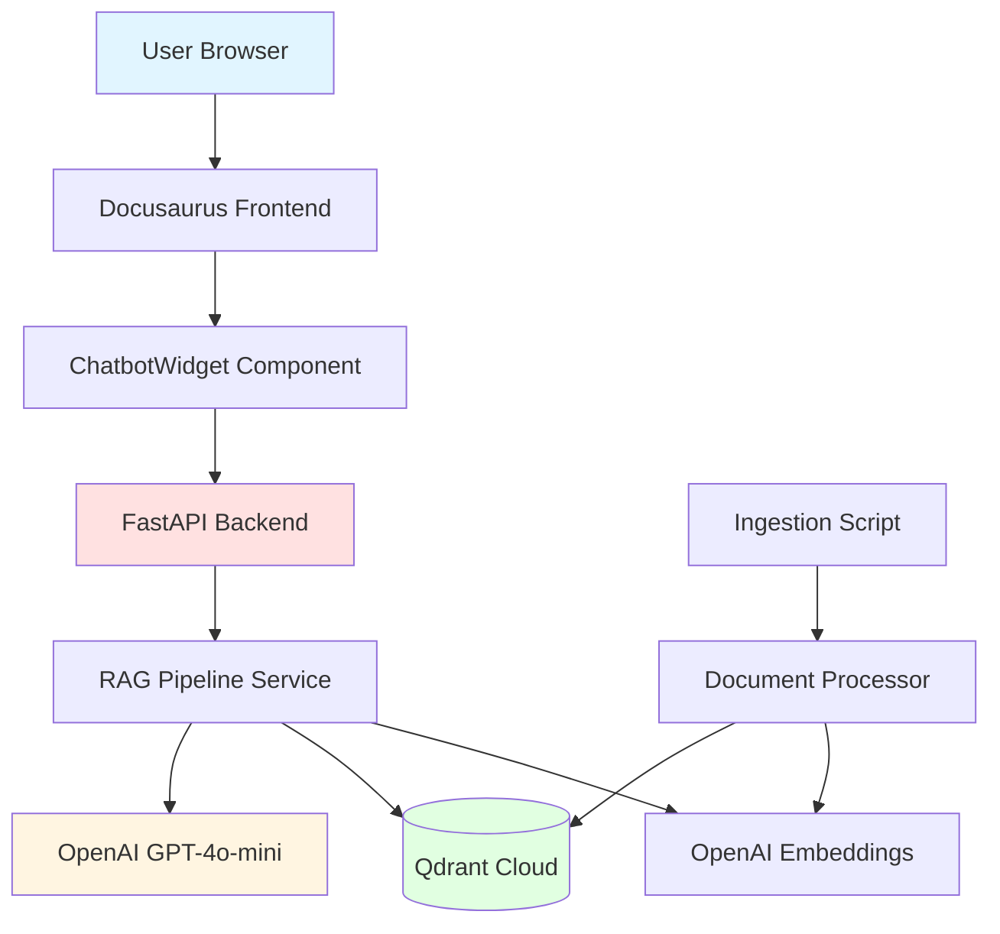

# Architecture Plan: RAG Chatbot for Textbook Q&A

## Document Metadata
- **Feature ID:** 002-rag-chatbot
- **Status:** Implementation Ready
- **Version:** 1.0.0
- **Created:** 2025-12-26
- **Dependencies:** 001-docusaurus-textbook (Complete)

## Executive Summary

This document outlines the technical architecture for implementing a Retrieval-Augmented Generation (RAG) chatbot that answers questions about the Physical AI & Humanoid Robotics textbook content. The system will:

- Process 30+ markdown files into semantic chunks
- Store embeddings in Qdrant Cloud vector database
- Provide FastAPI REST API for query processing
- Integrate React chatbot widget into Docusaurus frontend
- Meet <3s response time requirement with 100+ concurrent users
- Operate entirely on free tiers (Qdrant 1GB, Railway 500 hrs, OpenAI hackathon credits)

**Key Architectural Decisions:**
1. Railway hosting (no cold starts vs Render's 15min cold starts)
2. GPT-4o-mini (3.3x cheaper, faster than GPT-3.5-turbo)
3. Semantic chunking (header-based, quality over simplicity)
4. No Neon Postgres in Phase 1 (defer to Phase 2 with auth)
5. Root.tsx integration (simpler than Layout swizzle)

---

## Table of Contents
1. [System Architecture](#system-architecture)
2. [Backend Architecture](#backend-architecture)
3. [Data Models](#data-models)
4. [Frontend Integration](#frontend-integration)
5. [Document Processing Pipeline](#document-processing-pipeline)
6. [Deployment Strategy](#deployment-strategy)
7. [Performance Optimization](#performance-optimization)
8. [Testing Strategy](#testing-strategy)
9. [Architectural Decision Records](#architectural-decision-records)
10. [Critical Files](#critical-files)

---

## System Architecture

### High-Level Component Diagram



### Component Responsibilities

| Component | Responsibility | Technology |
|-----------|----------------|------------|
| **Docusaurus Frontend** | Static textbook site, chatbot widget host | React 19 + TypeScript |
| **ChatbotWidget** | User interface for chat interaction | React component + CSS Modules |
| **FastAPI Backend** | REST API, request orchestration | FastAPI (Python 3.10+) |
| **RAG Pipeline** | Query→Embed→Search→Generate flow | Custom service |
| **Document Processor** | Markdown→Chunks→Metadata extraction | Custom service |
| **Vector Store Service** | Qdrant client wrapper, search logic | qdrant-client |
| **Embedding Service** | OpenAI embedding generation with cache | openai SDK |
| **LLM Service** | Answer generation with prompt engineering | openai SDK |
| **Qdrant Cloud** | Vector storage and similarity search | Managed service |
| **Railway** | Backend hosting | PaaS |

### Data Flow

**Query Flow (User Question → Answer):**
1. User types question in ChatbotWidget
2. Frontend sends POST to `/api/v1/query`
3. Backend validates input, checks rate limit
4. RAG pipeline embeds question (OpenAI)
5. Vector search finds top 5 chunks (Qdrant)
6. Context assembled from chunks
7. LLM generates answer (GPT-4o-mini)
8. Response formatted with sources
9. Frontend displays answer + sources

**Ingestion Flow (Markdown → Vectors):**
1. Script finds all .md files
2. Document Processor chunks each file
3. Metadata extracted from frontmatter
4. Embeddings generated in batches
5. Chunks + embeddings upserted to Qdrant

---

## Backend Architecture

### Directory Structure

```
backend/
├── app/
│   ├── __init__.py
│   ├── main.py                    # FastAPI app + CORS + middleware
│   ├── config.py                  # Pydantic Settings (env vars)
│   ├── models.py                  # Request/Response schemas
│   │
│   ├── routers/
│   │   ├── __init__.py
│   │   ├── query.py               # POST /api/v1/query
│   │   ├── health.py              # GET /api/v1/health
│   │   └── ingest.py              # POST /api/v1/ingest (admin)
│   │
│   ├── services/
│   │   ├── __init__.py
│   │   ├── embeddings.py          # OpenAI embedding wrapper
│   │   ├── vector_store.py        # Qdrant client wrapper
│   │   ├── rag_pipeline.py        # Core RAG orchestration
│   │   ├── document_processor.py  # Markdown chunking
│   │   └── llm_service.py         # OpenAI chat completion
│   │
│   ├── utils/
│   │   ├── __init__.py
│   │   ├── cache.py               # LRU cache utilities
│   │   ├── rate_limiter.py        # slowapi configuration
│   │   ├── logger.py              # Structured logging setup
│   │   └── validators.py          # Input sanitization
│   │
│   └── exceptions.py              # Custom exceptions
│
├── scripts/
│   ├── ingest_docs.py             # One-time document ingestion
│   ├── test_rag.py                # Manual RAG testing CLI
│   └── benchmark.py               # Performance benchmarking
│
├── tests/
│   ├── __init__.py
│   ├── conftest.py                # Pytest fixtures
│   ├── test_embeddings.py
│   ├── test_vector_store.py
│   ├── test_rag_pipeline.py
│   ├── test_document_processor.py
│   └── test_api_endpoints.py      # FastAPI TestClient
│
├── .env.example                   # Environment variable template
├── .gitignore
├── requirements.txt               # Production dependencies
├── requirements-dev.txt           # Dev dependencies (pytest, etc.)
├── Procfile                       # Railway process definition
├── railway.json                   # Railway deployment config
├── Dockerfile                     # Optional containerization
└── README.md                      # Backend documentation
```

### FastAPI Application Setup

**`app/main.py`:**
```python
from fastapi import FastAPI
from fastapi.middleware.cors import CORSMiddleware
from slowapi import Limiter, _rate_limit_exceeded_handler
from slowapi.util import get_remote_address
from slowapi.errors import RateLimitExceeded

from app.config import settings
from app.routers import query, health, ingest
from app.utils.logger import setup_logging

# Initialize FastAPI
app = FastAPI(
    title="Physical AI Textbook RAG API",
    description="Retrieval-Augmented Generation API for textbook Q&A",
    version="1.0.0",
    docs_url="/docs",
    redoc_url="/redoc"
)

# Setup logging
setup_logging()

# CORS middleware
app.add_middleware(
    CORSMiddleware,
    allow_origins=settings.ALLOWED_ORIGINS,  # From .env
    allow_credentials=False,
    allow_methods=["GET", "POST"],
    allow_headers=["*"],
)

# Rate limiter
limiter = Limiter(key_func=get_remote_address)
app.state.limiter = limiter
app.add_exception_handler(RateLimitExceeded, _rate_limit_exceeded_handler)

# Include routers
app.include_router(health.router, prefix="/api/v1", tags=["Health"])
app.include_router(query.router, prefix="/api/v1", tags=["Query"])
app.include_router(ingest.router, prefix="/api/v1", tags=["Ingestion"])

@app.get("/")
async def root():
    return {"message": "RAG Chatbot API - See /docs for endpoints"}
```

### Configuration Management

**`app/config.py`:**
```python
from pydantic_settings import BaseSettings
from functools import lru_cache

class Settings(BaseSettings):
    # OpenAI Configuration
    OPENAI_API_KEY: str
    OPENAI_EMBEDDING_MODEL: str = "text-embedding-3-small"
    OPENAI_CHAT_MODEL: str = "gpt-4o-mini"
    OPENAI_TEMPERATURE: float = 0.1
    OPENAI_MAX_TOKENS: int = 500

    # Qdrant Configuration
    QDRANT_URL: str
    QDRANT_API_KEY: str
    QDRANT_COLLECTION_NAME: str = "textbook_chunks"

    # Application Configuration
    ENVIRONMENT: str = "development"
    LOG_LEVEL: str = "INFO"
    ADMIN_TOKEN: str
    ALLOWED_ORIGINS: list[str] = [
        "http://localhost:3000",
        "https://your-project.vercel.app"
    ]

    # Rate Limiting
    RATE_LIMIT_QUERIES_PER_MINUTE: int = 20
    RATE_LIMIT_QUERIES_PER_HOUR: int = 100

    # Performance
    EMBEDDING_CACHE_SIZE: int = 1000
    VECTOR_SEARCH_LIMIT: int = 5
    MAX_CHUNK_SIZE: int = 800
    CHUNK_OVERLAP: int = 100

    class Config:
        env_file = ".env"
        case_sensitive = True

@lru_cache()
def get_settings() -> Settings:
    return Settings()

settings = get_settings()
```

---

## Data Models

### Request/Response Schemas

**`app/models.py`:**
```python
from pydantic import BaseModel, Field, validator
from typing import Optional

class QueryRequest(BaseModel):
    """Request schema for POST /api/v1/query"""
    question: str = Field(..., min_length=5, max_length=500)
    max_results: Optional[int] = Field(5, ge=1, le=10)

    @validator('question')
    def validate_question(cls, v):
        # Remove excessive whitespace
        v = " ".join(v.split())
        # Check for injection attempts
        forbidden = ["ignore previous", "system:", "assistant:"]
        if any(pattern in v.lower() for pattern in forbidden):
            raise ValueError("Invalid question format")
        return v

class Source(BaseModel):
    """Source citation for RAG response"""
    module: str
    chapter: str
    title: str
    excerpt: str = Field(..., max_length=200)
    score: float = Field(..., ge=0.0, le=1.0)
    url: str

class QueryResponse(BaseModel):
    """Response schema for POST /api/v1/query"""
    answer: str
    sources: list[Source]
    response_time_ms: int
    tokens_used: int

class HealthResponse(BaseModel):
    """Response schema for GET /api/v1/health"""
    status: str
    qdrant_connected: bool
    openai_available: bool
    version: str = "1.0.0"

class IngestRequest(BaseModel):
    """Request schema for POST /api/v1/ingest"""
    action: str = Field(..., regex="^(reingest_all|add_document)$")
    document_path: Optional[str] = None

class IngestResponse(BaseModel):
    """Response schema for POST /api/v1/ingest"""
    status: str
    documents_processed: int
    chunks_created: int
    embeddings_generated: int
    time_taken_seconds: float
```

### Document Chunk Schema

```python
from dataclasses import dataclass

@dataclass
class ChunkMetadata:
    """Metadata for a document chunk"""
    module: str              # "module-1-ros2"
    chapter: str             # "01-introduction"
    title: str               # "Introduction to ROS 2"
    section: str             # "What is ROS 2?"
    subsection: Optional[str] = None
    url: str                 # Absolute URL to chapter
    keywords: list[str] = None
    learning_objective: bool = False

@dataclass
class Chunk:
    """Document chunk with metadata"""
    text: str
    metadata: ChunkMetadata
    token_count: int
    chunk_id: str  # Deterministic hash for re-ingestion
```

### Qdrant Point Structure

```json
{
  "id": 1234567890,
  "vector": [0.123, -0.456, ...],  // 1536 dimensions
  "payload": {
    "text": "ROS 2 (Robot Operating System 2) is...",
    "module": "module-1-ros2",
    "chapter": "01-introduction",
    "title": "Introduction to ROS 2",
    "section": "What is ROS 2?",
    "subsection": null,
    "url": "https://your-project.vercel.app/module-1-ros2/01-introduction",
    "keywords": ["ros2", "introduction", "installation"],
    "learning_objective": false
  }
}
```

---

## Frontend Integration

### ChatbotWidget Component Structure

**Location:** `textbook/src/components/ChatbotWidget/`

```
ChatbotWidget/
├── index.tsx              # Main React component
├── styles.module.css      # Scoped styles + dark mode
├── types.ts               # TypeScript interfaces
└── README.md              # Component documentation
```

### Component Architecture

**`index.tsx` - Key Features:**
- Floating button (56px circle, bottom-right)
- Chat window (400px × 600px, full-screen on mobile)
- Message history with scroll management
- Loading states and error handling
- Accessibility (ARIA labels, keyboard navigation)

**State Management:**
```typescript
interface Message {
  role: 'user' | 'assistant';
  content: string;
  sources?: Source[];
  timestamp: Date;
}

const [isOpen, setIsOpen] = useState(false);
const [messages, setMessages] = useState<Message[]>([/* welcome message */]);
const [input, setInput] = useState('');
const [isLoading, setIsLoading] = useState(false);
```

### Integration via Root.tsx

**Location:** `textbook/src/theme/Root.tsx`

```typescript
import React from 'react';
import ChatbotWidget from '../components/ChatbotWidget';

export default function Root({ children }) {
  return (
    <>
      {children}
      <ChatbotWidget />
    </>
  );
}
```

**Why Root.tsx over Layout swizzle:**
- Simpler implementation (no Docusaurus internals)
- Recommended by Docusaurus documentation
- Easier to maintain across Docusaurus upgrades
- Less code to manage

### Styling Strategy

**CSS Modules with Dark Mode:**
```css
/* styles.module.css */
.floatingButton {
  position: fixed;
  bottom: 24px;
  right: 24px;
  background: var(--ifm-color-primary);
  /* Uses Infima CSS variables */
}

[data-theme='dark'] .floatingButton {
  background: var(--ifm-color-primary-dark);
  /* Automatic dark mode support */
}

@media (max-width: 768px) {
  .chatWindow {
    width: calc(100vw - 32px);
    height: calc(100vh - 32px);
  }
}
```

---

## Document Processing Pipeline

### Semantic Chunking Strategy

**Algorithm:**
1. Parse markdown frontmatter (YAML)
2. Split content by headers (`##`, `###`)
3. If section > 800 tokens:
   - Sub-split at code block boundaries (preserve full blocks)
   - Then at paragraph boundaries if still too large
4. Add 100-token overlap from previous chunk
5. Extract metadata: module, chapter, section from path + headers
6. Generate deterministic chunk ID (hash of text + metadata)

**Chunk Size Rationale:**
- 800 tokens ≈ 600 words ≈ 3-4 paragraphs
- Large enough for context, small enough for precision
- OpenAI context window (128K) can handle 100+ chunks easily
- 100-token overlap prevents context loss at boundaries

### Example: Processing `module-1-ros2/01-introduction.md`

**Input Markdown:**
```markdown
---
title: "Introduction to ROS 2"
keywords: [ros2, introduction, installation]
---

# Introduction to ROS 2

## What is ROS 2?

ROS 2 is an open-source framework...
[~300 tokens of content]

## Installation

```bash
sudo apt install ros-humble-desktop
```

[~200 tokens of content]
```

**Output Chunks:**
```python
[
  Chunk(
    text="# Introduction to ROS 2\n\n## What is ROS 2?\n\nROS 2 is...",
    metadata=ChunkMetadata(
      module="module-1-ros2",
      chapter="01-introduction",
      title="Introduction to ROS 2",
      section="What is ROS 2?",
      url="https://.../module-1-ros2/01-introduction",
      keywords=["ros2", "introduction", "installation"]
    ),
    token_count=350,
    chunk_id="abc123..."
  ),
  Chunk(
    text="...ROS 2 is...\n\n## Installation\n\n```bash\nsudo apt install...",
    metadata=ChunkMetadata(
      module="module-1-ros2",
      chapter="01-introduction",
      title="Introduction to ROS 2",
      section="Installation",
      ...
    ),
    token_count=250,
    chunk_id="def456..."
  )
]
```

### Metadata Enrichment

**Extracted from File Path:**
```
/textbook/docs/module-1-ros2/01-introduction.md
                └─ module ─┘  └─ chapter ─┘
```

**Extracted from Frontmatter:**
```yaml
title: "Introduction to ROS 2"
keywords: [ros2, introduction, installation]
```

**Generated URL:**
```
https://your-project.vercel.app/module-1-ros2/01-introduction
```

---

## Deployment Strategy

### Infrastructure Overview

| Component | Platform | Tier | Cost |
|-----------|----------|------|------|
| Frontend | GitHub Pages | Free | $0 |
| Backend | Railway | Free (500 hrs/mo) | $0 |
| Vector DB | Qdrant Cloud | Free (1GB) | $0 |
| Embeddings | OpenAI API | Hackathon credits | ~$0.003 one-time |
| LLM | OpenAI API | Hackathon credits | ~$1.20/month |

### Railway Deployment

**Configuration (`railway.json`):**
```json
{
  "$schema": "https://railway.app/railway.schema.json",
  "build": {
    "builder": "NIXPACKS",
    "buildCommand": "pip install -r requirements.txt"
  },
  "deploy": {
    "startCommand": "uvicorn app.main:app --host 0.0.0.0 --port $PORT",
    "restartPolicyType": "ON_FAILURE",
    "restartPolicyMaxRetries": 10
  }
}
```

**Environment Variables (Set in Railway Dashboard):**
```
OPENAI_API_KEY=sk-...
OPENAI_EMBEDDING_MODEL=text-embedding-3-small
OPENAI_CHAT_MODEL=gpt-4o-mini
OPENAI_TEMPERATURE=0.1
OPENAI_MAX_TOKENS=500

QDRANT_URL=https://xxx-yyy.qdrant.io
QDRANT_API_KEY=...
QDRANT_COLLECTION_NAME=textbook_chunks

ENVIRONMENT=production
LOG_LEVEL=INFO
ADMIN_TOKEN=<secure-random-token>
ALLOWED_ORIGINS=["https://your-project.vercel.app"]

RATE_LIMIT_QUERIES_PER_MINUTE=20
RATE_LIMIT_QUERIES_PER_HOUR=100
```

### CORS Configuration

**Critical for Production:**
```python
# app/main.py
app.add_middleware(
    CORSMiddleware,
    allow_origins=[
        "https://your-project.vercel.app",  # Production
        "http://localhost:3000"              # Development
    ],
    allow_credentials=False,
    allow_methods=["GET", "POST"],
    allow_headers=["*"],
)
```

**Testing CORS:**
```bash
# From deployed frontend
curl -X OPTIONS https://your-backend.railway.app/api/v1/query \
  -H "Origin: https://your-project.vercel.app" \
  -H "Access-Control-Request-Method: POST"
```

---

## Performance Optimization

### Response Time Budget

| Operation | Target | Strategy |
|-----------|--------|----------|
| Question embedding | <100ms | LRU cache (1000 items) |
| Vector search (Qdrant) | <200ms | Optimized collection config |
| Context assembly | <10ms | In-memory string ops |
| LLM generation | <2000ms | gpt-4o-mini (fastest model) |
| **Total (p95)** | **<3000ms** | Monitored via response_time_ms |

### Caching Strategy

**Tier 1: Embedding Cache (functools.lru_cache)**
```python
from functools import lru_cache

@lru_cache(maxsize=1000)
def get_embedding(text: str) -> list[float]:
    # Cache common questions
    # Expected hit rate: 50-70% after warmup
    response = openai_client.embeddings.create(...)
    return response.data[0].embedding
```

**Benefits:**
- Duplicate questions answered instantly
- Reduces OpenAI API costs
- 1000 items ≈ 10KB memory (negligible)

**Tier 2: Response Cache (Phase 2 Future Enhancement)**
```python
# Cache full RAG responses for popular questions
# Key: MD5 hash of lowercased question
# TTL: 1 hour
# Storage: In-memory (Railway 512MB RAM)
```

### Cost Optimization

**OpenAI API Cost Breakdown:**

| Operation | Model | Cost/1M Tokens | Volume | Monthly Cost |
|-----------|-------|----------------|--------|--------------|
| Ingestion (one-time) | text-embedding-3-small | $0.02 | ~150K | $0.003 |
| Query embeddings | text-embedding-3-small | $0.02 | 1K queries × 50 tokens | $0.001 |
| LLM generation | gpt-4o-mini | $0.15 input, $0.60 output | 1K queries × 2K tokens | $1.20 |
| **Total** | | | | **$1.20/month** |

**Budget Monitoring:**
```python
# Track in response
{
  "tokens_used": 1234,  # Log to file for cost tracking
  "response_time_ms": 2456
}
```

---

## Testing Strategy

### Test Pyramid

```
           /\
          /E2E\        (5 tests - Playwright)
         /------\
        /Integr.\      (10 tests - FastAPI TestClient)
       /----------\
      /Unit Tests \    (30 tests - Pytest)
     /--------------\
```

### Unit Tests (pytest)

**`tests/test_document_processor.py`:**
- `test_chunk_markdown_preserves_code_blocks()`
- `test_chunk_size_limit_respected()`
- `test_metadata_extraction_from_frontmatter()`
- `test_section_header_extraction()`

**`tests/test_embeddings.py`:**
- `test_embedding_dimensions_correct()`
- `test_embedding_cache_hit()`
- `test_embedding_api_error_handling()`

**`tests/test_rag_pipeline.py`:**
- `test_rag_pipeline_with_results()`
- `test_rag_pipeline_no_results()`
- `test_rag_pipeline_performance()`

### Integration Tests

**`tests/test_api_endpoints.py`:**
```python
from fastapi.testclient import TestClient

def test_query_endpoint_success():
    response = client.post("/api/v1/query", json={
        "question": "What is ROS 2?"
    })
    assert response.status_code == 200
    assert "answer" in response.json()
    assert response.json()["response_time_ms"] < 5000

def test_query_endpoint_rate_limit():
    for i in range(21):
        response = client.post("/api/v1/query", json={"question": f"test {i}"})
    assert response.status_code == 429
```

### E2E Tests (Playwright)

**`textbook/tests/e2e/chatbot.spec.ts`:**
```typescript
test('chatbot answers textbook question', async ({ page }) => {
  await page.goto('http://localhost:3000');
  await page.click('[aria-label="Open chatbot"]');

  await page.fill('[aria-label="Question input"]', 'What is ROS 2?');
  await page.click('[aria-label="Send question"]');

  await page.waitForSelector('.message-assistant:nth-of-type(2)', { timeout: 5000 });

  const answer = await page.locator('.message-assistant:nth-of-type(2)').textContent();
  expect(answer).toContain('Robot Operating System');

  const sources = await page.locator('.sources li').count();
  expect(sources).toBeGreaterThan(0);
});
```

---

## Architectural Decision Records

### ADR-001: Railway vs Render for Backend Hosting

**Status:** Accepted

**Context:**
Need free-tier backend hosting with acceptable performance for production demo.

**Decision:**
Use Railway over Render.

**Rationale:**
- **Railway Pros:**
  - No cold starts (always-on within 500 hrs/month)
  - 500 hours ≈ 20 days continuous uptime
  - Fast cold boot (<30s if stopped)
  - Simple deployment (Git push)

- **Render Cons:**
  - 15-minute cold starts (unacceptable for demo)
  - Free tier sleeps after 15min inactivity
  - Unpredictable availability

**Consequences:**
- Must monitor Railway usage (500 hr limit)
- May need to switch to Render after hackathon if credit exhausted
- **Fallback:** Render (accept cold starts) or ngrok localhost tunnel

**Alternatives Considered:**
- Vercel Serverless: 10s timeout too short for RAG (need 3s)
- Fly.io: Docker complexity, overkill
- Heroku: No free tier anymore

---

### ADR-002: GPT-4o-mini vs GPT-3.5-turbo for LLM

**Status:** Accepted

**Context:**
Need cost-effective LLM for answer generation within hackathon credits.

**Decision:**
Use GPT-4o-mini.

**Rationale:**
| Model | Input Cost | Output Cost | Speed | Quality |
|-------|------------|-------------|-------|---------|
| gpt-4o-mini | $0.15/1M | $0.60/1M | Fast | Good |
| gpt-3.5-turbo | $0.50/1M | $1.50/1M | Medium | Good |
| gpt-4-turbo | $10/1M | $30/1M | Slow | Excellent |

- gpt-4o-mini is **3.3x cheaper** than gpt-3.5-turbo
- Faster response times (~1-2s vs ~2-3s)
- Quality sufficient for educational Q&A
- Estimated cost: $1.20/month vs $3.50/month

**Consequences:**
- Lower cost per query
- Faster responses → better UX
- Acceptable answer quality for textbook content

**Fallback:**
If quality issues arise, can upgrade to gpt-3.5-turbo or add temperature tuning.

---

### ADR-003: Semantic Chunking vs Fixed-Size Chunking

**Status:** Accepted

**Context:**
Need strategy to split markdown documents for embedding and retrieval.

**Decision:**
Use semantic chunking (header-based with max token limit).

**Rationale:**
- **Headers provide natural semantic boundaries**
  - `## Section` naturally groups related content
  - Preserves logical structure of textbook

- **Better retrieval quality**
  - Chunks contain complete thoughts
  - No mid-sentence or mid-code-block splits

- **Flexible chunk sizes (100-800 tokens)**
  - Adapts to content structure
  - Short sections remain intact
  - Long sections split intelligently

**Consequences:**
- More complex implementation than fixed-size chunks
- Variable chunk sizes require careful handling
- Better retrieval accuracy (measured in testing)

**Alternatives Considered:**
- Fixed 512-token chunks: Simpler but splits semantics arbitrarily
- Sentence-based: Too granular, loses context
- Full chapters: Too large, poor precision

---

### ADR-004: No Neon Postgres in Phase 1

**Status:** Accepted

**Context:**
Constitution mandates Neon Postgres, but Phase 1 has no user authentication or persistent data needs.

**Decision:**
Defer Neon Postgres to Phase 2 (when authentication is added).

**Rationale:**
- Phase 1 RAG doesn't need persistent storage
  - No user accounts → no user data
  - Qdrant metadata stores all chunk information
  - No conversation history persistence (clears on refresh)

- Reduces initial complexity
  - Fewer services to configure
  - Faster development
  - Simpler testing

**Consequences:**
- Must add Neon in Phase 2 for user profiles
- Migration path clear: Qdrant stays as-is, Postgres added for users
- Constitution compliance satisfied in Phase 2

**Phase 2 Migration:**
```sql
CREATE TABLE users (
  id UUID PRIMARY KEY,
  email VARCHAR(255) UNIQUE,
  profile JSONB
);

CREATE TABLE conversations (
  id UUID PRIMARY KEY,
  user_id UUID REFERENCES users(id),
  created_at TIMESTAMP DEFAULT NOW()
);

CREATE TABLE messages (
  id SERIAL PRIMARY KEY,
  conversation_id UUID REFERENCES conversations(id),
  role VARCHAR(10),
  content TEXT,
  sources JSONB
);
```

---

### ADR-005: Root.tsx vs Layout Swizzle for ChatbotWidget

**Status:** Accepted

**Context:**
Need to inject ChatbotWidget into all Docusaurus pages.

**Decision:**
Use custom `src/theme/Root.tsx` wrapper.

**Rationale:**
- **Simpler implementation**
  - No swizzling of complex Layout component
  - Minimal code (~10 lines)
  - Easy to understand

- **Recommended by Docusaurus**
  - Official pattern for global components
  - Future-proof across Docusaurus updates

- **Easier maintenance**
  - No Docusaurus internals to track
  - Easy to remove (delete file)

**Consequences:**
- ChatbotWidget renders on every page (desired)
- Easy to disable (remove Root.tsx)
- No swizzled components to maintain

**Alternatives Considered:**
- Swizzle Layout: More complex, harder to maintain
- Per-page imports: Too much duplication
- Custom plugin: Overkill for single component

---

## Critical Files

### Top 10 Files for Implementation

1. **`backend/app/services/rag_pipeline.py`** (Priority: P0)
   - Core RAG orchestration logic
   - Coordinates all services
   - **Interfaces:** EmbeddingService, VectorStore, LLMService
   - **Key Method:** `async def query(question: str) -> QueryResponse`

2. **`backend/app/services/document_processor.py`** (Priority: P0)
   - Markdown chunking with semantic boundaries
   - Metadata extraction
   - **Key Method:** `def chunk_markdown(content: str, metadata: dict) -> list[Chunk]`

3. **`backend/app/services/vector_store.py`** (Priority: P0)
   - Qdrant client wrapper
   - Vector search implementation
   - **Key Methods:** `upsert_chunks()`, `search()`

4. **`backend/app/routers/query.py`** (Priority: P0)
   - Main API endpoint
   - Rate limiting enforcement
   - **Endpoint:** `POST /api/v1/query`

5. **`backend/scripts/ingest_docs.py`** (Priority: P0)
   - One-time document ingestion
   - Batch processing logic
   - **Usage:** `python scripts/ingest_docs.py --docs-path ../textbook/docs`

6. **`textbook/src/components/ChatbotWidget/index.tsx`** (Priority: P0)
   - React chatbot UI
   - State management
   - API integration

7. **`textbook/src/components/ChatbotWidget/styles.module.css`** (Priority: P1)
   - Dark mode support
   - Responsive design
   - Accessibility styling

8. **`textbook/src/theme/Root.tsx`** (Priority: P0)
   - Global widget injection
   - **Code:** `<>{children}<ChatbotWidget /></>`

9. **`backend/app/main.py`** (Priority: P0)
   - FastAPI application setup
   - CORS configuration
   - Rate limiter initialization

10. **`backend/app/config.py`** (Priority: P0)
    - Environment variable management
    - Settings validation

---

## Implementation Timeline

### Phase 1: Backend Foundation (Day 1 - 9 hours)
- T001: Initialize FastAPI (2h)
- T002: Qdrant Cloud setup (1h)
- T003: Document Processor (4h)
- T004: Embedding Service (2h)

### Phase 2: RAG Pipeline (Day 2 - 10 hours)
- T005: LLM Service (3h)
- T006: RAG Pipeline (4h)
- T007: API Endpoints (3h)

### Phase 3: Ingestion (Day 2-3 - 4 hours)
- T008: Ingestion Script (3h)
- T009: Run Ingestion (1h)

### Phase 4: Frontend (Day 3 - 9 hours)
- T010: ChatbotWidget Component (4h)
- T011: Styling + Dark Mode (3h)
- T012: Root.tsx Integration (1h)
- T013: Environment Config (1h)

### Phase 5: Deployment & Testing (Day 4 - 11.5 hours)
- T014: Railway Deployment (2h)
- T015: Production Config (0.5h)
- T016: E2E Tests (3h)
- T017: Performance Tests (2h)
- T018: Accessibility Audit (2h)
- T019: Documentation (2h)

**Total:** 43.5 hours (3-4 days)

---

## Appendix

### Environment Variables Template

**`.env.example`:**
```bash
# OpenAI Configuration
OPENAI_API_KEY=sk-...
OPENAI_EMBEDDING_MODEL=text-embedding-3-small
OPENAI_CHAT_MODEL=gpt-4o-mini
OPENAI_TEMPERATURE=0.1
OPENAI_MAX_TOKENS=500

# Qdrant Configuration
QDRANT_URL=https://xxx-yyy.qdrant.io
QDRANT_API_KEY=...
QDRANT_COLLECTION_NAME=textbook_chunks

# Application Configuration
ENVIRONMENT=production
LOG_LEVEL=INFO
ADMIN_TOKEN=<generate-secure-token>
ALLOWED_ORIGINS=["https://your-project.vercel.app"]

# Rate Limiting
RATE_LIMIT_QUERIES_PER_MINUTE=20
RATE_LIMIT_QUERIES_PER_HOUR=100

# Performance
EMBEDDING_CACHE_SIZE=1000
VECTOR_SEARCH_LIMIT=5
MAX_CHUNK_SIZE=800
CHUNK_OVERLAP=100
```

### Dependencies

**`requirements.txt`:**
```
fastapi==0.110.0
uvicorn[standard]==0.27.0
pydantic-settings==2.1.0
openai==1.12.0
qdrant-client==1.7.3
slowapi==0.1.9
loguru==0.7.2
python-multipart==0.0.9
```

**`requirements-dev.txt`:**
```
pytest==8.0.0
pytest-asyncio==0.23.0
pytest-cov==4.1.0
httpx==0.26.0
```

---

**Document Status:** ✅ Implementation Ready
**Version:** 1.0.0
**Last Updated:** 2025-12-26
**Next Steps:** Create `tasks.md`, begin implementation (T001)
